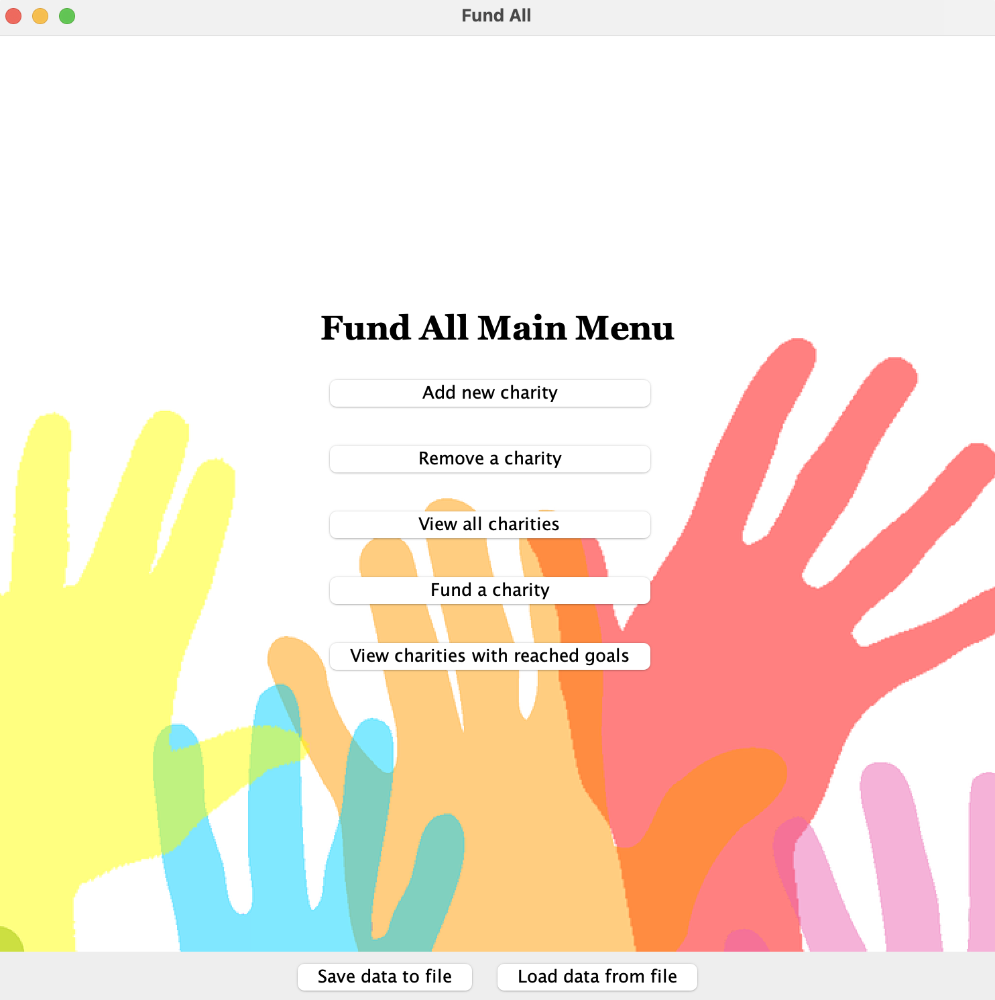

# Fund All
## A Charity Donation Project

### Overview:

This Java-based project, titled *Fund All*, is a charity/donation app. Users willing to donate will be able to 
choose a charity/cause of their choice and donate their desired amount of funds. 

    

Some of the features will include:

- **View a charity/cause**: Donors will be able to view a list of charities/causes and select one to donate to!
- **Start a charity/cause**: Users will be able to add their own charities/causes to the given list!
- **View charities/causes that have reached their goals**: Users can view charities/causes that have reached their 
goals and opt to fund them as well!

### My interest:

This project is important for me because, as an international student from a third-world country, 
there is no such application in my country that allows users to choose a charity from a list, and instead they must 
research on their own and send their donations via direct transfer. This app would allow a much more convenient 
and efficient pathway for donations, and perhaps the ease of it would lead to a higher number of donations!

### User Stories:

- As a user, I want to be able to add a charity/cause with a specific funding goal and also remove a charity/cause.
- As a user, I want to be able to view a list of charities/cause.
- As a user, I want to be able to see how many charities have reached their funding goals and view them.
- As a user, I want to be able to send funds to the charity/cause that I choose. 
- As a user, I want to be able to save my charities list to file (if I so choose)
- As a user, I want to be able to be able to load my charities list from file (if I so choose)

### Instructions for Grader:

- You can add a charity by clicking the button "Add new charity"
- You can remove a charity by clicking the button "Remove a charity"
- You can fund a charity by clicking the button "Fund charity"
- You can view charities that have reached their goals by clicking the button "View charities with reached goals"
- You can locate my visual component as the background of the application (saved in the data folder)
- You can save the state of my application by pressing the button "Save charities to file"
- You can reload the state of my application by pressing the button "Load charities from file"

### Phase 4: Task 2:

A sample event log:

Event log:\
Tue Apr 02 01:35:09 PDT 2024\
Charity added: Save the turtles!\
Tue Apr 02 01:35:09 PDT 2024\
Charity added: Reforestation\
Tue Apr 02 01:35:09 PDT 2024\
Charity added: Climate Change\
Tue Apr 02 01:35:22 PDT 2024\
Funds added to Save the turtles!: 2500.0\
Tue Apr 02 01:35:27 PDT 2024\
Viewed charities with reached goals\
Tue Apr 02 01:35:43 PDT 2024\
Charity Reforestation removed.

### Phase 4: Task 3:
#### Refactoring & Reflection
If I had more time, I would refactor the CharityAppGUI class; it is quite lengthy and difficult to understand
at first glance. I would split up the class (e.g. adding a charity and funding a charity) into different classes for 
each panel in order to make the GUI structure much more comprehensible and reader-friendly. Although, not a form 
of refactoring, I would also definitely introduce an ID field for a given charity, allowing 
the user to remove a charity based on its ID instead of its index number in the list of charities provided.

